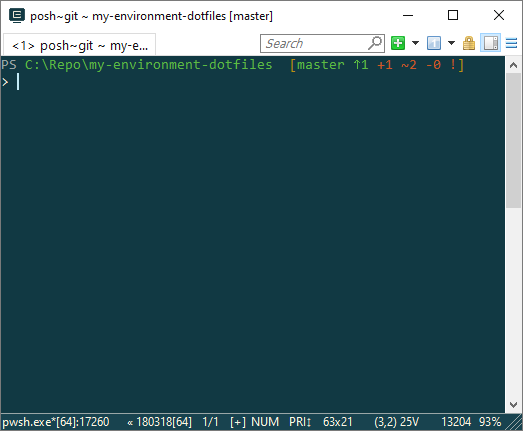

# My environment settings on Windows
Including:
- console prompt
- hotkeys
- tools

## Files
### Choco_installs.ps1
Installs tools.

### Hotkeys.ahk
Hotkey to make a window always on top.

### profile.ps1
PowerShell profile
- git prompt using posh-git
- fix encoding to run git-bash tools in PowerShell

### ConEmu.xml
My ConEmu terminal settings.

### Set_hard_links.ps1
Makes git working directory files to be hard links to actual settings. This is useful to compare and commit changes in a system. Note that `git checkout` replaces hard links with normal files, not touching actual files.

## git-ignore-line
Git filter driver that ignores a certain line of code. That line appears unmodified on commit.